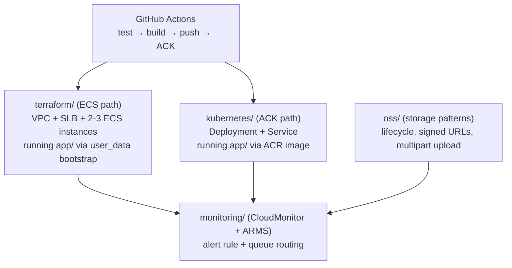

# Alibaba Cloud DevOps Labs

Runnable, end-to-end companion code for the Alibaba Cloud articles on [Dumka Esaenwi's technical blog](https://dumkaesaenwi.pages.dev). One coherent project — a sample app, the infrastructure that runs it, the pipeline that deploys it, the storage patterns it relies on, and the monitoring that watches it — across eight articles, including a real AWS-to-Alibaba migration case study.

## Architecture



## Contents

| Folder | Article | What's runnable |
| --- | --- | --- |
| [`app/`](app) | — | The sample Express service every other folder deploys. `GET /health` is what the SLB health check, ACK readiness probe, and CI smoke test all check. |
| [`terraform/`](terraform) | Terraform on Alibaba Cloud: Infrastructure as Code | Full VPC + ECS + SLB module, wired end-to-end (SLB server group actually points at the ECS instances, with an HTTP health check — not declared-but-unconnected resources). Staging and production `.tfvars`. |
| [`github-actions/`](github-actions) | Building a CI/CD Pipeline to Alibaba Cloud | Pipeline: runs `app/`'s tests, builds the image, pushes to ACR, applies the K8s manifests, rolls out, then smoke-tests the live endpoint. |
| [`kubernetes/`](kubernetes) | Kubernetes on Alibaba Cloud: ACK vs. Self-Managed | StorageClass, cluster provisioning script, and the actual Deployment/Service/PodDisruptionBudget the pipeline deploys. |
| [`oss/`](oss) | Object Storage Service (OSS) Patterns | Lifecycle rules XML, a signed-URL generator, and a multipart upload script for files over 100MB. |
| [`monitoring/`](monitoring) | Monitoring and Observability with CloudMonitor and ARMS | Alert rule definition and the queue-routing command that gets it out of raw SMS. |

The [multi-cloud cost comparison](https://dumkaesaenwi.pages.dev/articles/multi-cloud-cost-optimization-alibaba-aws-azure-gcp) and [AWS migration case study](https://dumkaesaenwi.pages.dev/articles/migrating-aws-to-alibaba-cloud-lessons) articles are strategy/comparison pieces without their own runnable artifacts — the `terraform/` and `kubernetes/` folders here are the concrete Alibaba Cloud side of that migration.

## Running it end to end

```bash
# 1. Provision the ECS-based path
cd terraform
terraform init
terraform apply -var-file=environments/staging.tfvars

# 2. Or provision ACK instead
cd ../kubernetes
./create-cluster.sh

# 3. Build and test the app locally
cd ../app
npm install
npm test

# 4. Wire up CI (copy github-actions/deploy-ack.yml to .github/workflows/)
#    and push — it builds, deploys to ACK, and smoke-tests the live endpoint.

# 5. Apply the OSS bucket patterns for anything the app stores
cd ../oss
aliyun oss lifecycle --method put oss://my-bucket lifecycle.xml
```

## Prerequisites

- [Alibaba Cloud CLI](https://www.alibabacloud.com/help/en/cli/) (`aliyun`), configured: `aliyun configure`
- [Terraform](https://developer.hashicorp.com/terraform/install) >= 1.5 with the `aliyun/alicloud` provider
- `kubectl`, `docker`, `node` >= 18
- Python 3 with `oss2` installed, for the OSS scripts

## Why it's structured this way

Each article makes a specific, checkable claim — that an SLB server group should actually reference the backend instances by ID, that a signed URL beats a public bucket, that a Spot node pool needs `--eviction-policy Delete`. This repo is the proof: every one of those claims is working code you can run against your own account, not a snippet that only looks plausible.
